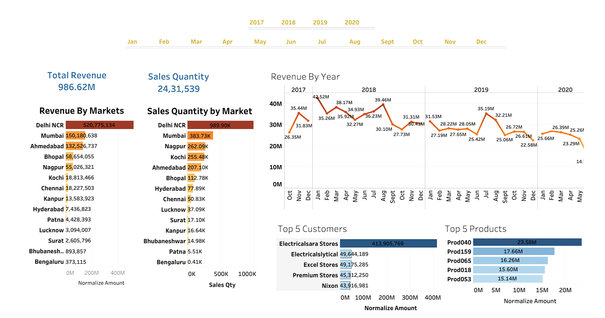

# Sales Analytics Dashboard (Tableau)

## Project Overview
This project presents an interactive sales analytics dashboard built using Tableau to analyze multi-year sales performance data (2017–2020). The dashboard provides insights into revenue trends, market contribution, top customers, and product-level performance.

## Business Objective
To analyze sales data and identify:
- Revenue trends over time
- Market-wise performance
- Top revenue-generating customers
- High-performing products
- Sales quantity distribution

## Dataset Information
- Time Period: 2017–2020
- Total Revenue: 986M+
- Total Sales Quantity: 2M+ units
- Data structured across multiple relational tables (Orders, Customers, Products, Markets, Date)

## Dashboard Features
- Dynamic year-wise filtering
- Cross-filtering across all visuals
- Monthly revenue trend analysis
- Market-wise revenue and sales comparison
- Top 5 customers by revenue
- Top products by revenue contribution

## Key Insights
- Delhi NCR contributes the highest share of total revenue.
- Revenue peaked around 2018 before showing fluctuations.
- Revenue is highly concentrated among top customers.
- Certain product categories consistently outperform others.
  
## Tools & Technologies
- SQL (Data Extraction)
- Tableau (Data modeling, joins, calculated fields, visualization)

## Dashboard Preview

